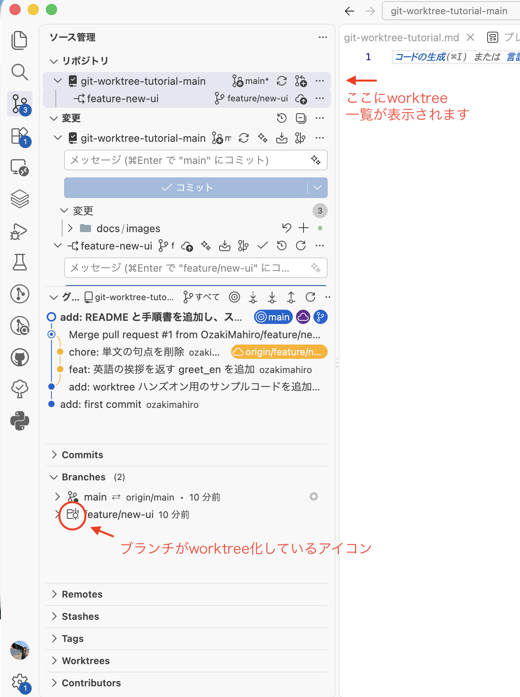
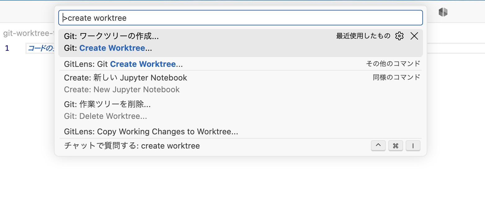
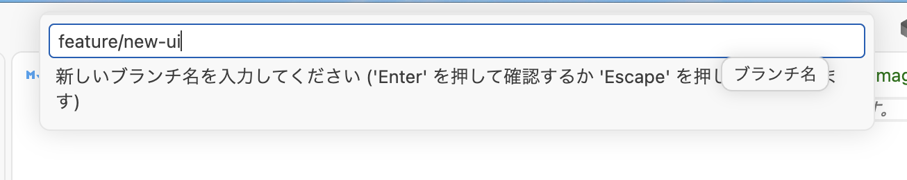
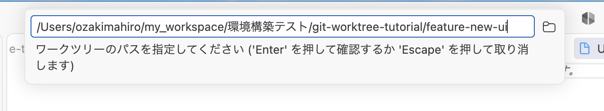
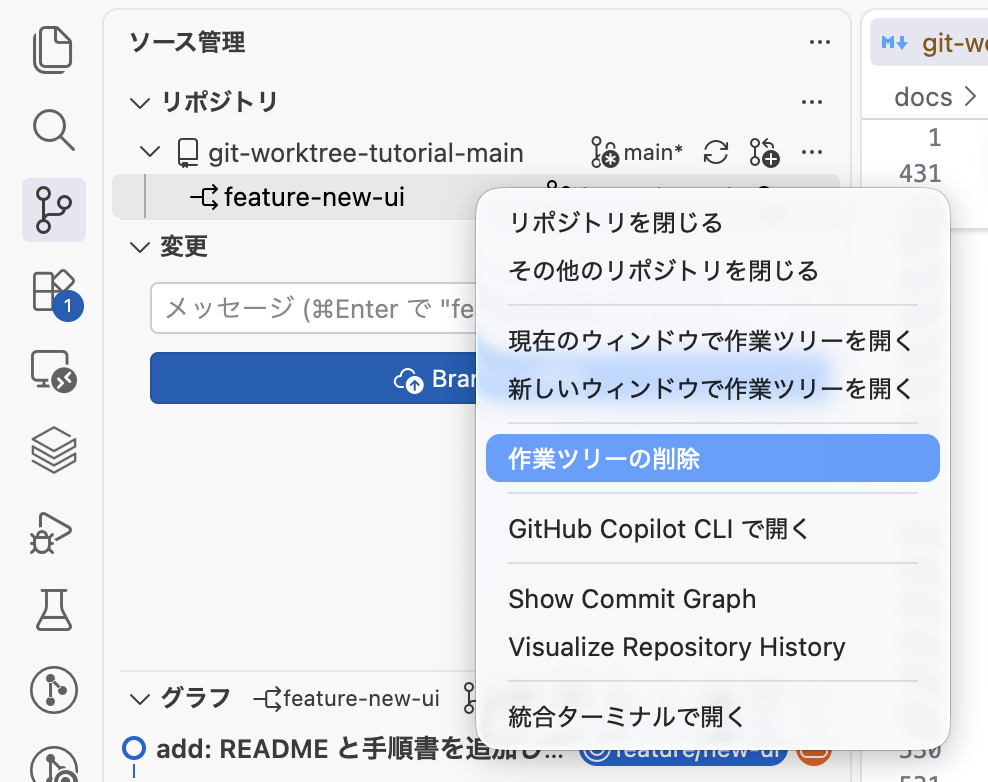

# git worktree ハンズオン手順書（CLI + VS Code GUI）

同じリポジトリの複数のブランチを、**別々のフォルダーで同時に開いて作業する**ための機能が `git worktree` です。
この手順書は、参考記事の流れを実際にこのリポジトリで再現しながら、**ターミナル（CLI）** と **VS Code の GUI** の両方のやり方を並べて説明します。

- 参考記事: [【入門】Git Worktree とは？ 初心者向けに解説](https://zenn.dev/tmasuyama1114/articles/git_worktree_beginner)
- 検証環境: macOS / git 2.50.1 / VS Code 1.134.0（日本語言語パック）/ uv 0.11.25
- 掲載しているコマンド出力は、このリポジトリで実際に実行した結果です。パスのうち各自の環境で異なる部分は `<<PATH_TO_PROJECT>>` / `~/...` と省略表記にしています
- コードブロックの `>>>` で始まる行は**コマンドの出力**です（そのまま貼り付けて実行しないでください）

> **GUI について**: VS Code 1.134 の**組み込み Git 拡張**が worktree に対応しているため、GitLens などの拡張機能は不要です。
> ただし日本語 UI では「**ワークツリー**」と「**作業ツリー**」という 2 通りの訳語が混在しています。**どちらも worktree のことです**。

---

## 目次

- [git worktree ハンズオン手順書（CLI + VS Code GUI）](#git-worktree-ハンズオン手順書cli--vs-code-gui)
  - [目次](#目次)
  - [1. worktree とは何か](#1-worktree-とは何か)
  - [2. VS Code 側の事前設定](#2-vs-code-側の事前設定)
  - [3. 現状を確認する](#3-現状を確認する)
    - [CLI](#cli)
    - [VS Code GUI](#vs-code-gui)
  - [4. 新しいブランチと worktree を同時に作る](#4-新しいブランチと-worktree-を同時に作る)
    - [CLI](#cli-1)
    - [VS Code GUI](#vs-code-gui-1)
  - [5. 既存ブランチで worktree を作る](#5-既存ブランチで-worktree-を作る)
    - [CLI](#cli-2)
    - [VS Code GUI](#vs-code-gui-2)
  - [6. worktree を開く・行き来する](#6-worktree-を開く行き来する)
    - [CLI](#cli-3)
    - [VS Code GUI](#vs-code-gui-3)
  - [7. 並行して作業する](#7-並行して作業する)
    - [やってみる](#やってみる)
    - [VS Code GUI](#vs-code-gui-4)
  - [8. main に取り込む](#8-main-に取り込む)
    - [CLI](#cli-4)
    - [VS Code GUI](#vs-code-gui-5)
  - [9. 後片付けする](#9-後片付けする)
    - [9-1. gitクリーンなworktree を削除する](#9-1-gitクリーンなworktree-を削除する)
    - [9-2. 未コミットの変更が残っているとき](#9-2-未コミットの変更が残っているとき)
    - [9-3. フォルダーを手で消してしまったとき](#9-3-フォルダーを手で消してしまったとき)
    - [VS Code GUI](#vs-code-gui-6)
  - [10. つまずきポイント](#10-つまずきポイント)
  - [11. どんなときに使うか](#11-どんなときに使うか)
  - [12. コマンド早見表](#12-コマンド早見表)
  - [付録: スクリーンショット撮影チェックリスト](#付録-スクリーンショット撮影チェックリスト)

---

## 1. worktree とは何か

Git は次の 3 つを分けて考えると理解しやすくなります。

| 用語 | 意味 |
|---|---|
| リポジトリ | 履歴と管理データの保管庫。実体は `.git` フォルダー |
| ブランチ | コミット履歴の枝分かれ |
| 作業ディレクトリ | 実際にファイルを編集しているフォルダー |

ふつうは「1 リポジトリ = 1 作業ディレクトリ」で、ブランチを切り替えると**同じフォルダーの中身が丸ごと入れ替わります**。
worktree を使うと、**1 つの `.git` を共有したまま、作業ディレクトリだけを複数持てます**。

このハンズオンで作る構成:

```
git-worktree-tutorial/
├── git-worktree-tutorial-main/      # main ブランチ ← .git の実体はここだけ
│   └── .git/
├── git-worktree-tutorial-new-ui/    # feature/new-ui
│   └── .git                         # ← フォルダーではなくファイル
└── git-worktree-tutorial-hotfix/    # hotfix/bug-123
    └── .git
```

worktree 側の `.git` はフォルダーではなく、本体を指し示すだけの**テキストファイル**です。

```bash
# worktree 側の .git の中身を見る
cat ../git-worktree-tutorial-new-ui/.git

# 出力
>>> gitdir: ~/<<PATH_TO_PROJECT>>/git-worktree-tutorial-main/.git/worktrees/git-worktree-tutorial-new-ui
```

つまり worktree は「フォルダーだけ増やして、履歴は 1 か所で共有する」仕組みです。`git clone` を 2 回するのと違い、履歴を二重に持ちません。

---

## 2. VS Code 側の事前設定

必須ではありませんが、最初にやっておくと GUI での体験がよくなります。

`F1`（または `⇧⌘P`）→ `基本設定: ユーザー設定を開く (JSON)` で `settings.json` に追記:

```jsonc
{
  // worktree を自動検出して、ソース管理ビューに表示する（既定は false）
  "git.detectWorktrees": true,

  // 自動検出する worktree の上限（既定は 50）
  "git.detectWorktreesLimit": 50,

  // worktree 作成時に、.gitignore 対象のファイルも新フォルダーへコピーしたい場合に指定
  // 例: "git.worktreeIncludeFiles": [".env"]
  "git.worktreeIncludeFiles": []
}
```

設定 UI から探す場合は、設定画面の検索ボックスに `worktree` と入力すると上記 3 つが出てきます。

> **`git.worktreeIncludeFiles` の注意**: ここに指定できるのは「`.gitignore` に載っていて、かつパターンに一致するファイル」だけです。
> `.venv` のような重い仮想環境をコピーするのは非推奨で、worktree 側で `uv sync` し直すほうが確実です（→ [10. つまずきポイント](#10-つまずきポイント)）。

---

## 3. 現状を確認する

### CLI

```bash
# worktree の一覧
git worktree list

# 出力
>>> ~/.../git-worktree-tutorial-main    3623376 [main]
```

まだ worktree は本体 1 つだけです。

### VS Code GUI

ソース管理ビュー（`⌃⇧G`）を開き、リポジトリ名の右にある `…`（表示とその他のアクション）→ **ワークツリー** サブメニューを開きます。
worktree が 1 つもないときは「このリポジトリにはワークツリーがありません。」と表示されます。



*ソース管理ビューの `…` メニューを開き、「ワークツリー」サブメニューが見えている状態*

---

## 4. 新しいブランチと worktree を同時に作る

記事でいちばん推されているパターンです。**ブランチを作ってから worktree を作る**のではなく、**両方を 1 手でやります**。

### CLI

```bash
# ブランチの作成とフォルダーの作成を 1 手でやる
git worktree add -b feature/new-ui ../git-worktree-tutorial-new-ui

# 出力
>>> Preparing worktree (new branch 'feature/new-ui')
>>> HEAD is now at 3623376 add: worktree ハンズオン用のサンプルコードを追加
```

このコマンド 1 つで次の 3 つが同時に起きます。

1. `feature/new-ui` ブランチを作る
2. `../git-worktree-tutorial-new-ui` フォルダーを作る
3. そのフォルダーで `feature/new-ui` をチェックアウトする

確認:

```bash
# worktree の一覧
git worktree list

# 出力
>>> ~/.../git-worktree-tutorial-main      3623376 [main]
>>> ~/.../git-worktree-tutorial-new-ui    3623376 [feature/new-ui]
```

```bash
# ブランチの一覧
git branch

# 出力
>>> + feature/new-ui
>>> * main
```

`*` は「今いる worktree のブランチ」、`+` は「**別の worktree でチェックアウト中**のブランチ」を表します。

### VS Code GUI

1. `F1` を押してコマンドパレットを開き、`ワークツリー` と入力して **`Git: ワークツリーの作成...`** を選ぶ

   

   *`F1` →「ワークツリー」で絞り込んだコマンドパレット*

2. 「**新しいワークツリーを作成するには、以下からブランチまたはタグを選択します**」というリストが出る
   - **新しいブランチを作りたいとき**: 一番上の **`＋ 新しいブランチの作成...`** を選び、ブランチ名（例: `feature/new-ui`）を入力する
   - 既存のブランチ／タグから作りたいときは、そのままリストから選ぶ（→ [5 章](#5-既存ブランチで-worktree-を作る)）

   

   *元にするブランチ／タグを選ぶ画面。先頭に「新しいブランチの作成...」がある*

   > いま本体でチェックアウト中のブランチ（例: `main`）を選ぶと、「ブランチ "main" は、現在のリポジトリで既にチェックアウトされています。」と警告が出て、**新しいブランチの作成**に誘導されます。1 ブランチは 1 か所でしかチェックアウトできないためです。

3. 「**ワークツリーのパス**」の入力欄が出る。既定値は次のような場所が入っています。

   ```
   ~/<<PATH_TO_PROJECT>>/git-worktree-tutorial-main.worktrees/feature-new-ui
   ```

   ブランチ名の `/` は `-` に置き換えられます。記事と同じ「リポジトリと横並び」にしたい場合は、ここを

   ```
   ~/<<PATH_TO_PROJECT>>/git-worktree-tutorial-new-ui
   ```

   に書き換えます。入力欄の右にあるフォルダーアイコン（**ワークツリーの作成先を選択してください**）からフォルダー選択ダイアログを開くこともできます。**一度選んだ親フォルダーは記憶され、次回以降の既定値になります。**

   

   *「ワークツリーのパス」入力欄。既定値を書き換えているところ*

4. `Enter` で確定すると worktree が作られます。

---

## 5. 既存ブランチで worktree を作る

すでにあるブランチ（例: 他の人が作ったり、git上で作ったりされた `hotfix/bug-123`）を別フォルダーで開くパターンです。

### CLI

```bash
# 既存ブランチを用意（既にあるなら不要）
git branch hotfix/bug-123

# 既存ブランチをworktreeで開く
git worktree add ../git-worktree-tutorial-hotfix hotfix/bug-123

# 出力
>>> Preparing worktree (checking out 'hotfix/bug-123')
>>> HEAD is now at 3623376 add: worktree ハンズオン用のサンプルコードを追加
```

`-b` を付けないときは、`git worktree add <パス> <ブランチ名>` の順です（**パスが先、ブランチが後**）。

```bash
# worktree の一覧
git worktree list

# 出力
>>> ~/.../git-worktree-tutorial-main      3623376 [main]
>>> ~/.../git-worktree-tutorial-hotfix    3623376 [hotfix/bug-123]
>>> ~/.../git-worktree-tutorial-new-ui    3623376 [feature/new-ui]
```

リモートのブランチをレビューしたいときは、先に取得してから指定します。

```bash
# リモートのブランチをレビュー用に別フォルダーで開く
git fetch origin
git worktree add ../git-worktree-tutorial-review origin/feature/xxx
```

タグを指定すれば、その時点のバージョンを別フォルダーで開けます。

```bash
# タグ v1.0.0 時点のファイル一式を別フォルダーで開く
git worktree add ../git-worktree-tutorial-v1 v1.0.0
```

### VS Code GUI

4 章とまったく同じ **`Git: ワークツリーの作成...`** から、リストで既存のブランチ（またはリモートブランチ、タグ）を選ぶだけです。
選んだブランチが既に他の worktree で使われている場合は、

> ブランチ "hotfix/bug-123" は、"…/git-worktree-tutorial-hotfix" のワークツリーで既にチェックアウトされています。

と表示され、**そのワークツリーを開くか**を聞かれます。

---

## 6. worktree を開く・行き来する

### CLI

単純にフォルダーを移動するだけです。

```bash
# worktree のフォルダーへ移動するだけ
cd ../git-worktree-tutorial-new-ui
```

本体のフォルダーから、移動せずに別 worktree を操作したいときは `-C` が便利です。

```bash
# 別 worktree の状態を、そこへ移動せずに確認する
git -C ../git-worktree-tutorial-new-ui status
git -C ../git-worktree-tutorial-new-ui log --oneline -3
```

### VS Code GUI

`F1` から次のコマンドを使います。

| コマンド | 動き |
|---|---|
| `Git: 新しいウィンドウで作業ツリーを開く` | 別ウィンドウで開く。**並行作業したいならこれ** |
| `Git: 現在のウィンドウで作業ツリーを開く` | 今のウィンドウを切り替える |


*worktree を新しいウィンドウで開いた状態。左下ステータスバーのブランチ名が本体ウィンドウと違うことを確認する*

worktree ごとにウィンドウを分けておけば、片方で機能開発、もう片方でバグ修正、という並行作業が `git stash` なしで成立します。

---

## 7. 並行して作業する

各 worktree は**独立したファイルのセット**を持ちます。片方で編集しても、もう片方には影響しません。

### やってみる

`feature/new-ui` 側で `src/greeting.py` に関数を足してコミットします。

```bash
cd ../git-worktree-tutorial-new-ui

# src/greeting.py に greet_en() を追加して保存してから
git add src/greeting.py
git commit -m "feat: 英語の挨拶を返す greet_en を追加"

# 履歴の確認
git log --oneline -2

# 出力
>>> c8bae12 feat: 英語の挨拶を返す greet_en を追加
>>> 3623376 add: worktree ハンズオン用のサンプルコードを追加
```

`hotfix/bug-123` 側では別の修正をします。

```bash
cd ../git-worktree-tutorial-hotfix

# src/greeting.py の greet() を、空文字なら「ゲスト」と表示するよう修正してから
git add src/greeting.py
git commit -m "fix: 空文字の名前が渡されたときにゲスト表記を使うよう修正"

# 履歴の確認
git log --oneline -2

# 出力
>>> dcb6863 fix: 空文字の名前が渡されたときにゲスト表記を使うよう修正
>>> 3623376 add: worktree ハンズオン用のサンプルコードを追加
```

本体（`main`）に戻って確認すると、**どちらの変更も入っていません**。

```bash
cd ../git-worktree-tutorial-main

# 変更なし（何も表示されない = クリーン）
git status --short

# greet() も元のまま
tail -2 src/greeting.py

# 出力
>>>     """
>>>     return f"こんにちは、{name}さん！"
```

同じファイルを 3 か所で別々の状態にしたまま持てる、というのが worktree の効き目です。

### VS Code GUI

各ウィンドウのソース管理ビューはそれぞれの worktree を指しています。いつもどおり `+` でステージ、メッセージを書いて **コミット** を押すだけです。
「今どのブランチを触っているか」は、**左下ステータスバーのブランチ名**で必ず確認してください。ウィンドウが増えると取り違えやすいポイントです。

---

## 8. main に取り込む

worktree で作ったブランチも、ふつうのブランチとまったく同じです。

### CLI

```bash
cd ../git-worktree-tutorial-main

# worktree で作ったブランチを取り込む
git merge feature/new-ui

# 出力
>>> Updating 3623376..93be0d9
>>> Fast-forward
>>>  src/greeting.py | 21 +++++++++++++++++++--
>>>  1 file changed, 19 insertions(+), 2 deletions(-)
```

マージ後は、共有している履歴が進んだことが `git worktree list` にも表れます。

```bash
# worktree の一覧
git worktree list

# 出力（main と feature/new-ui が同じコミットを指すようになった）
>>> ~/.../git-worktree-tutorial-main      93be0d9 [main]
>>> ~/.../git-worktree-tutorial-hotfix    dcb6863 [hotfix/bug-123]
>>> ~/.../git-worktree-tutorial-new-ui    93be0d9 [feature/new-ui]
```

リモートに出す場合は、worktree の中からそのまま push できます。

```bash
# 本体のフォルダーにいたまま、worktree のブランチを push する
git -C ../git-worktree-tutorial-new-ui push -u origin feature/new-ui
```

### VS Code GUI

本体ウィンドウで `F1` → **`Git: マージ...`** を選び、取り込みたいブランチ（`feature/new-ui`）を選びます。

> **補足**: `Git: ワークツリーの変更を移行する...` という似た名前のコマンドがありますが、これは**別物**です。
> 「別の worktree の未コミット変更を、今のリポジトリに移してくる（移動元の変更は破棄される）」もので、実行時に「これは元に戻すことができません。」と警告が出ます。ブランチのマージには使いません。

---

## 9. 後片付けする

### 9-1. gitクリーンなworktree を削除する

```bash
# worktree を削除する
git worktree remove ../git-worktree-tutorial-new-ui

# 一覧から消えたことを確認
git worktree list

# 出力
>>> ~/.../git-worktree-tutorial-main      93be0d9 [main]
>>> ~/.../git-worktree-tutorial-hotfix    dcb6863 [hotfix/bug-123]
```

**worktree を消してもブランチは残ります。**

```bash
# ブランチの一覧
git branch

# 出力（feature/new-ui は残っている）
>>>   feature/new-ui
>>> + hotfix/bug-123
>>> * main
```

ブランチも要らなければ削除します。マージ済みなら `-d` で消せます。

```bash
# マージ済みブランチの削除
git branch -d feature/new-ui

# 出力
>>> Deleted branch feature/new-ui (was 93be0d9).
```

### 9-2. 未コミットの変更が残っているとき

```bash
# 未コミットの変更が残ったまま削除しようとすると失敗する
git worktree remove ../git-worktree-tutorial-hotfix

# 出力
>>> fatal: '../git-worktree-tutorial-hotfix' contains modified or untracked files, use --force to delete it
```

消えて困らないと分かっているなら `--force` を付けます。

```bash
# 変更ごと削除する
git worktree remove --force ../git-worktree-tutorial-hotfix
```

### 9-3. フォルダーを手で消してしまったとき

Finder やコマンドでフォルダーごと消しても、Git 側の参照はしばらく残ります。

```bash
# フォルダーを手で消してしまった状況を再現
rm -rf ../git-worktree-tutorial-hotfix

# 一覧にはまだ残っている
git worktree list

# 出力
>>> ~/.../git-worktree-tutorial-main      93be0d9 [main]
>>> ~/.../git-worktree-tutorial-hotfix    dcb6863 [hotfix/bug-123] prunable
```

末尾に `prunable`（＝掃除できる）と付きます。`prune` で整理します。

```bash
# 実体のない worktree の参照を掃除する
git worktree prune

# 確認
git worktree list

# 出力
>>> ~/.../git-worktree-tutorial-main    93be0d9 [main]
```

未マージのブランチは `-d` では消せないので、その場合は `-D` を使います。

```bash
# 未マージのブランチを -d で消そうとすると止められる
git branch -d hotfix/bug-123

# 出力
>>> error: the branch 'hotfix/bug-123' is not fully merged
>>> hint: If you are sure you want to delete it, run 'git branch -D hotfix/bug-123'
```

```bash
# 承知のうえで強制削除する
git branch -D hotfix/bug-123

# 出力
>>> Deleted branch hotfix/bug-123 (was dcb6863).
```

### VS Code GUI

1. `F1` → **`Git: 作業ツリーを削除...`**
2. 「**削除するワークツリーを選択する**」から対象を選ぶ



*「削除するワークツリーを選択する」の一覧*

- 未コミットの変更があると「作業ツリーには、変更されたまたは未追跡のファイルが含まれています。強制的に削除しますか?」と聞かれます（＝ CLI の `--force`）
- **今開いているウィンドウ自身の worktree は削除できません。**「現在の作業ツリーは削除できません。最初にメイン リポジトリに切り替えてください。」と出るので、本体のウィンドウに移ってから実行してください
- ブランチの削除は別操作です。`F1` → `Git: ブランチの削除...` から行います

---

## 10. つまずきポイント

| つまずき | 何が起きるか | どうするか |
|---|---|---|
| 同じブランチを 2 か所で開こうとする | `fatal: 'feature/new-ui' is already used by worktree at '…'` | **1 ブランチ = 1 worktree**。別ブランチを作るか、既存の worktree を開く |
| 本体で `git checkout` できない | 上と同じエラー。worktree 側で使用中のブランチには切り替えられない | その worktree のウィンドウに移動して作業する |
| 片方の変更がもう片方に出てこない | worktree ごとにファイルは独立しているため（仕様） | コミットしてから `git merge` / `git fetch` で取り込む |
| worktree 側で Python が動かない | `.venv` は `.gitignore` 対象なのでコピーされない | worktree のフォルダーで `uv sync`（または `uv run …`）を実行して作り直す |
| ディスクが増える | worktree の数だけファイルの実体が増える | 使い終わったら `git worktree remove`。履歴は共有なので clone よりは軽い |
| 日本語 UI の表記がバラバラ | 「ワークツリー」と「作業ツリー」が混在 | どちらも worktree のこと。コマンド検索は `ワークツリー` と `作業ツリー` の両方で試す |
| どのウィンドウがどのブランチか分からなくなる | 別ウィンドウに増えるほど混乱する | 左下ステータスバーのブランチ名を確認する。ウィンドウごとに色を変える拡張も有効 |

---

## 11. どんなときに使うか

- **作業中に緊急のバグ修正が来た**: 今の作業を `stash` せず、別 worktree で `hotfix` を切って対応する
- **プルリクエストのレビュー**: `git fetch origin` → `git worktree add ../review origin/相手のブランチ` で、自分の作業を止めずに動かして確認する
- **複数機能の並行開発**: 機能ごとにウィンドウを分けて進める。AI エージェントに別ブランチの作業を並行で任せる用途とも相性がよい
- **バージョン比較**: `git worktree add ../v1 v1.0.0` で、旧バージョンと現行を横に並べて挙動を比べる

---

## 12. コマンド早見表

| やりたいこと | CLI | VS Code（`F1` から） |
|---|---|---|
| 一覧を見る | `git worktree list` | ソース管理ビュー `…` → ワークツリー |
| 新ブランチ + worktree | `git worktree add -b <branch> <path>` | `Git: ワークツリーの作成...` → 新しいブランチの作成... |
| 既存ブランチで worktree | `git worktree add <path> <branch>` | `Git: ワークツリーの作成...` → ブランチを選択 |
| 別ウィンドウで開く | （フォルダーを開く） | `Git: 新しいウィンドウで作業ツリーを開く` |
| 同じウィンドウで開く | `cd <path>` | `Git: 現在のウィンドウで作業ツリーを開く` |
| 削除 | `git worktree remove <path>` | `Git: 作業ツリーを削除...` |
| 強制削除 | `git worktree remove --force <path>` | 削除時に「強制的に削除しますか?」で「はい」 |
| 参照の掃除 | `git worktree prune` | （手動削除時は自動検出で整理される） |
| ブランチ削除 | `git branch -d` / `-D <branch>` | `Git: ブランチの削除...` |

---

## 付録: スクリーンショット撮影チェックリスト

この手順書には画像の差し込み口を用意してあります。**画像を置くまではリンク切れ表示になります**。
撮影したら `docs/images/` に**下記のファイル名で**保存すれば、そのまま表示されます。

撮り方（macOS）:

- `⇧⌘4` → `Space` → ウィンドウをクリック … ウィンドウ単位で撮る（影付き）
- `⇧⌘5` … 範囲やオプションを選んで撮る
- 既定の保存先はデスクトップ。撮影後に `docs/images/` へ移動してリネームする

| # | ファイル名 | 撮る画面 |
|---|---|---|
| 1 | `01-command-palette-create-worktree.png` | `F1` で `ワークツリー` と入力し、`Git: ワークツリーの作成...` が候補に出ている状態 |
| 2 | `02-select-branch.png` | 「新しいワークツリーを作成するには、以下からブランチまたはタグを選択します」の一覧（先頭の「新しいブランチの作成...」が見えるように） |
| 3 | `03-worktree-path.png` | 「ワークツリーのパス」の入力欄（既定パスと、右のフォルダーアイコンが見えるように） |
| 4 | `04-new-window.png` | worktree を新しいウィンドウで開いた状態（左下ステータスバーのブランチ名が入るように） |
| 5 | `05-scm-worktrees-menu.png` | ソース管理ビューの `…` → 「ワークツリー」サブメニューを開いた状態 |
| 6 | `06-delete-worktree.png` | `Git: 作業ツリーを削除...` の「削除するワークツリーを選択する」一覧 |

> 撮影時は、リポジトリのパスや他人の情報が写り込んでいないか確認してから公開してください。
